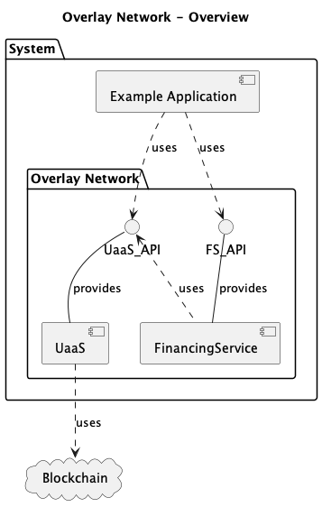

# Overlay Network

The Overlay Network provides an API that Applications can use to interact with the blockchain. The Overlay Network API provides the ability to:
* Fund transactions
* Broadcast transactions 
* Capture transactions of interest (that have been previously broadcast)


# Components
The following diagram shows the key components that make up the system.

Note that in this project we have provided an `Example Application` which uses the `Overlay Network`.




# Directory Structure

```
.
├── README.md - This file
├── data
├── docs
├── example-app
└── overlay-system
```
* `data` - data and config for this project
* `docs` - supporting documentations
* `example-app` - this contains the Example Application
* `overlay-system` - this contains the Overlay Network components

# Example Application

The Example Application supports the following use cases


More details can be found [here](example-app/README.md)

# Overlay Network

More details can be found [here](docs/Overlay-Network.md)