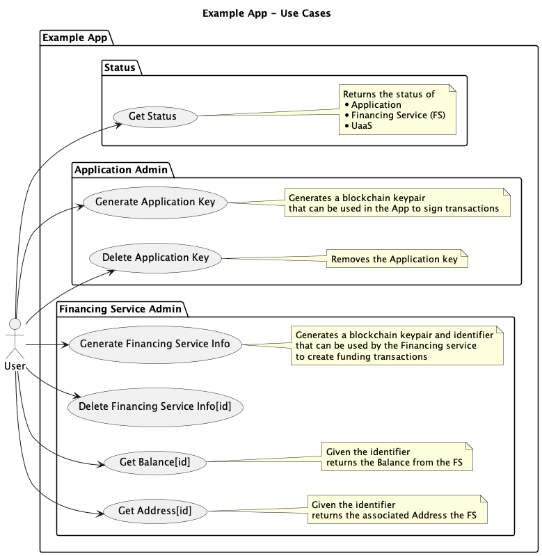
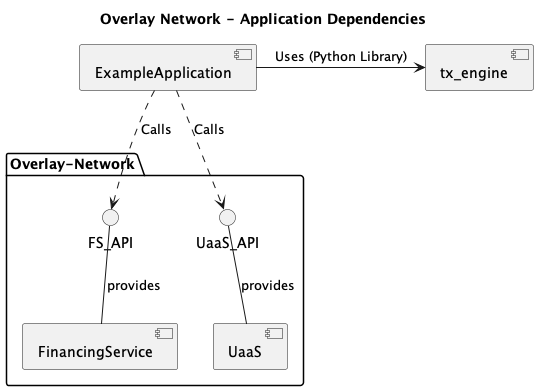

# Application

# Example Application

The application presents a Swagger interface which can be used to interact with it.

The application writes data to the blockchain.

# Setting up the application

For a step by step guide to setting up the application see 
[here](Step_by_step_application_setup.md) 

# Use Cases

# Generating Keys

The following digram shows the steps required in generating the keys used by the application.

# Dependencies
This diagram shows how the `Application` calls the `Financing Service` and `UTXO as a Service` (`UaaS`).

The diagram also shows that the `Application` uses the `tx-engine` Python library.

