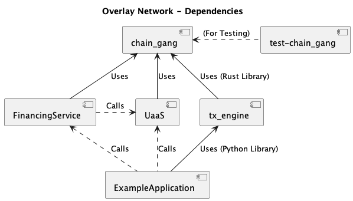

# Development




# Debugging Docker Image

If you want to access the Python code directly in the Docker image then pass `bash` as the first argument on the command line. As shown below:

``` bash
% ./run.sh bash
/app/python# ls
main.py
/app/python# python3 main.py
hello world
```


# Lint
To perform a static code analysis of the Python source code, run the following

``` bash
cd example-app
./lint.sh

```