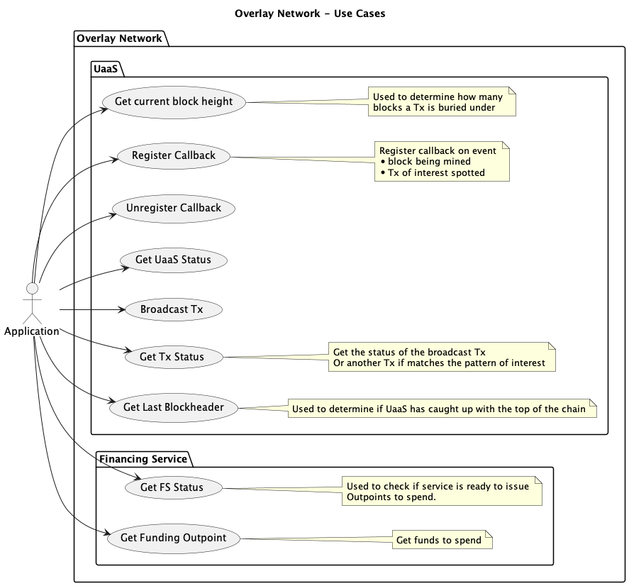

# Overlay Network

This document provides details of the Overlay Network.

The Overlay Network provides an API that Applications can use to interact with the blockchain. The Overlay Network API provides the ability to:
* Fund transactions
* Broadcast transactions 
* Capture broadcast transactions of interest

# Components
The following diagram shows the key components that make up the Overlay Network.

From the diagram we can see that there are two key components that make up the Overlay Network.
These are 
* Financing Service - Creates funding transactions
* UaaS - Provides an interface to the blockchain

# Use Cases

The following diagram shows the use cases supported by the Overlay Network

