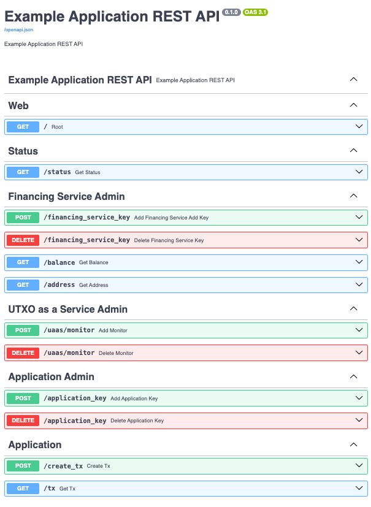
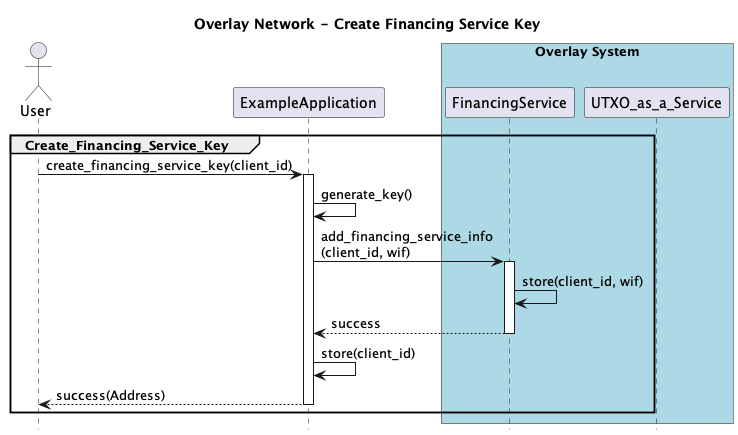

# Step by step Application setup

This document provides a step by step guide to setting up the Application. 

This is required as the Application does not ship with any keys to use, so these must be generated and registered as required.
Once these steps are complete the data is stored and the Application is ready to use. So these steps only have to be performed once.

Note that for a real-world Application many of these steps could be performed before running the Application and stored in configuration data.

The steps are:

1. Clone the Repository 
2. Build the Application Docker Image
3. Start the Overlay Network Docker Compose
4. Run the Application Docker Image
5. Check System Status
6. Create Financing Service Key
7. Register Financing Service Key Address with UaaS
8. Fund Financing Service Key Address
9. Check the Financing Service Address Balance
10. Create an Application Key
11. Create a Transaction
12. Get the Transaction


## 1) Clone the Repository 
Use the following command to clone the repository:
```bash
% git clone https://github.com/nchain-innovation/overlay-network
```

## 2) Build the Application Docker Image
To build the Application Docker image
``` bash
% cd example-app
% ./build.sh
```

## 3) Start the Overlay Network Docker Compose
To start the Overlay System use:
``` bash
% cd overlay-system
% docker compose up --detach
```

To stop the Overlay System use:
``` bash
% docker compose down
```
If you are turning off your computer then stop the Overlay System, as 
it may resume without connections to peers etc.


## 4) Run the Application Docker Image
To run the Application Docker image:
```bash
% cd example-app
% ./run.sh
INFO:     Started server process [1]
INFO:     Waiting for application startup.
INFO:     Application startup complete.
INFO:     Uvicorn running on http://0.0.0.0:3050 (Press CTRL+C to quit)
```

This will start a Swagger web server at http://127.0.0.1:3050/docs (depending on configuration) which should look like this:




## 5) Check the System Status

Click on the Application Swagger interface, then under `Status`:

1. Expand the `Get Status` endpoint.
2. Click on the "Try it out" button 
3. Click on the "Execute" button 

You should see a response similar to:


Here we are looking for the following:
* `Application Status` section
  * `"blockchain_enabled": true` 
* `Financing Service Status` section
  * `"blockchain_status": Connected` 
* `UaaS Status` section  
  * `"last block time":` within 30 minutes of the `current_time` provided by the Application status, this means that the UaaS is current with the blockchain.

If there are any issues with any of the above then either the supporting services are not running or the Application configuration is incorrect.

The configuration of the Example Application can be found in the TOML file `/data/example-app.toml`. 

The TOML configuration file also provides information about how to connect to the `Financing Service` and `UTXO as a Service`.

More details can be found [here](../docs/Configuration.md)

Note that some settings assume the Application is being run in Docker, in particular the `url`s. 
These will need to change if you run the Application outside Docker.


## 6) Create Financing Service Key

This section details the process of generating the Financing Service Key. 

This key will be used by the Financing service to fund the Applications transactions.




Click on the Application Swagger interface, then under `Financing Service Admin`:
1. Expand the `Add Financing Service Key` endpoint.
2. Click on the "Try it out" button.
3. Enter a unique `client_id` into the text box.
4. Click on the "Execute" button.

The Response body should show:
```JSON

{
  "status": "Success",
  "Address": "mnUyj....kL81vSPsQJdyXRnaQ2Mb38mh2"
}
```

This shows the Address associated with the Financing Service Key. 

This Address can be obtained using the `Get Address` endpoint, which requests the address from the Financing Service.

The Application stores the `client_id` name in its `dynamic config` file.
For more details about `dynamic config` see [here](../docs/Configuration.md).


## 7). Register Financing Service Key Address with UaaS

The Address needs to be registered with UTXO as a Service (UaaS).

This enables UaaS to track transactions that use this address in the locking script (also known as script pubkey).

Click on the Application Swagger interface, then under `UTXO as a Service Admin`:
1. Expand the `Add Monitor` endpoint.
2. Click on the "Try it out" button.
3. Enter a `name` and `address` into the text box.
4. Click on the `Execute` button.

The Response body should show:
```JSON
{
    "status": "Success"
}
```

If you make a mistake you can delete it from the `UaaS` using the `Delete Monitor` endpoint.

## 8). Fund Financing Service Key Address

Once the Financing Service Key has been generated it needs to be funded.


Funds are provided by a testnet Faucet, such as: https://witnessonchain.com/faucet/tbsv

This needs to be provided with the Financing Service Key's Address, that we obtained from the previous step.


On the Faucet website:
1. Enter the Financing Service Key's Address into the text box.
2. Click on the `Verify you are human` check box (if present).
3. Click on the `Shoot me the coin` button.

The Faucet will provide feedback to indicate that the funds were successfully sent.

It can take a few minutes for the funds to arrive.

## 9). Check the Financing Service Address Balance
Click on the Application Swagger interface, then under `Financing Service Admin` section:
1. Expand the `Get Balance` endpoint.
2. Click on the "Try it out" button.
3. Click on the "Execute" button.

The response should look like:


This indicates that there are confirmed and/or unconfirmed satoshis associated with this address.


## 10). Create an Application Key

The Application uses an additional key for its transactions.


Click on the Application Swagger interface, then:
1. Under `Application Admin` section, expand the `Add Application Key` endpoint.
2. Click on the "Try it out" button.
3. Click on the "Execute" button.

The Response body should show:
```JSON
{
    "status": "Success"
}
```

Now the Application is ready to use!

## 11). Create a Transaction

Now we will create a transaction using the Application.


1. Expand the `Create Tx` endpoint.
2. Click on the "Try it out" button.
3. Enter a `data` into the text box (the default is `string`).
4. Click on the "Execute" button.

The Response body should show:

``` JSON
{
  "status": "Success",
  "txid": "87d8f60ddccdf4f7e221af81fafbe015fc62c5ded94dcffce38f82bfa4ecf361"
}
```

## 11). Get the Transaction

Then you can use the `txid` to get the transaction using the `Get Tx` endpoint.

1. Expand the `Get Tx` endpoint.
2. Click on the "Try it out" button.
3. Enter the `txid` into the text field.
4. Click on the "Execute" button.

The Response body should show:

```JSON
{
  "hash": "87d8f60ddccdf4f7e221af81fafbe015fc62c5ded94dcffce38f82bfa4ecf361",
  "tx": {
    "version": 1,
    "vin": [
      {
        "prevout": {
          "hash": "18e30fcbc000192d51c001c5573c5b7eb34a660d47ec2429eb93c559009d460c",
          "n": 1
        },
        "scriptSig": "473044022059223664a70608981da30c6ebd4713e1d164d32f94ca1d3b2aa8079e9e9994ab02203affc3241abe917ed6a67c8368ad9df92fcb8eab4343e18aba930d9c43a23a414121027faa8b6273953eebac242a2944e3e73370ca85b054fbdf0e7aaa9eccc792fde8",
        "sequence": "ffffffff"
      }
    ],
    "vout": [
      {
        "value": 0,
        "scriptPubKey": "006a45784170702c737472696e67",
        "spent": true
      }
    ],
    "locktime": 0
  }
}
```

The transaction can also be found on `WhatsOnChain` testnet https://test.whatsonchain.com/
Which will show the Output as ASCII
```
jExApp,string
```
Where
* `j` - is an artifact of the OP_0 OP_RETURN
* `ExApp` - is the application name
* `string` - was the default text written to the output

These values are the same as the field
```
"scriptPubKey": "006a45784170702c737472696e67",
```
Using an ASCII table such as https://www.asciitable.com/ we get


| Hex Digit | Meaning |
| --- | --- |
| 00 | OP_O |
| 6a | OP_RETURN |
| 45 | Character `E` |
| 78 | Character `x` |
| 41 | Character `A` |
| 70 | Character `p` |
| 70 | Character `p` |
| 2c | Character `,` |
| 73 | Character `s` |
| 74 | Character `t` |
| 72 | Character `r` |
| 69 | Character `i` |
| 6e | Character `n` |
| 67 | Character `g` |

