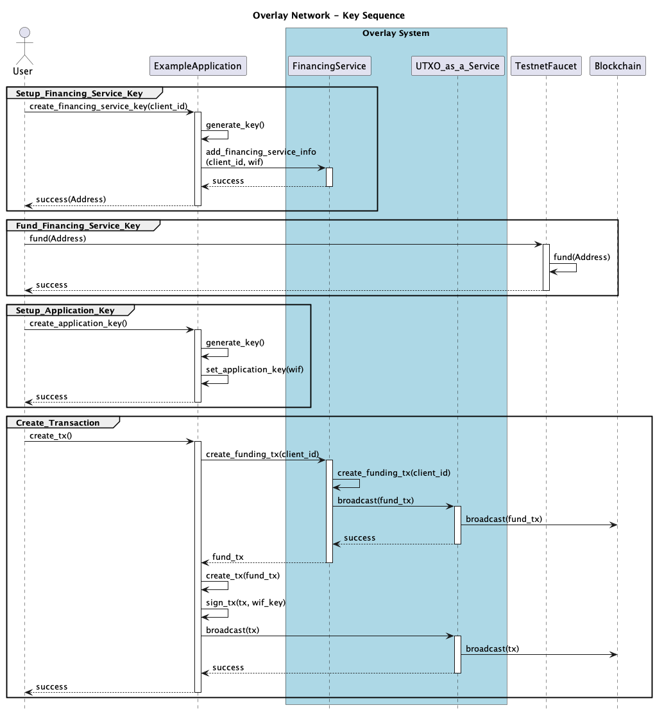

# Example Application

The example application presents a web page and writes data to the blockchain.


# Building Docker Image
``` bash
% cd example-app
% ./build.sh
```


# Running Docker Image
```bash
% cd example-app
% ./run.sh
INFO:     Started server process [1]
INFO:     Waiting for application startup.
INFO:     Application startup complete.
INFO:     Uvicorn running on http://0.0.0.0:3050 (Press CTRL+C to quit)
```

This will host a Swagger web server at http://127.0.0.1:3050/docs

The configuration of the Example Application can be found in `/data/example-app.toml`


# Debugging Docker Image
``` bash
% ./run.sh bash
/app/python# ls
main.py
/app/python# python3 main.py
hello world
```

# Use Cases


# Generating Keys



# Dependencies

